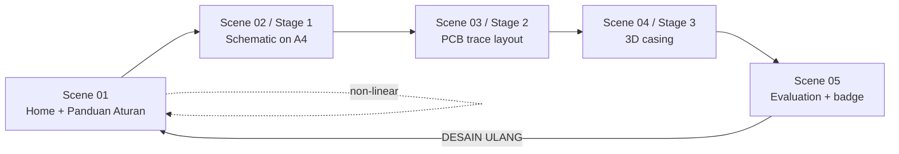

# Project Overview

## Identity

| Field | Value |
| --- | --- |
| Name | **E-DrawLab** |
| Full title | E-DrawLab: Desain CAD Elektronika |
| Sub-title | Laboratorium Maya Skema Rangkaian dan Desain CAD Elektronika |
| Type | Bahan Ajar Digital / Laboratorium Maya Interaktif (virtual lab) |
| Curriculum element | `TMR_TLEKTRO_4` — Gambar Teknik Elektronika dan Pemodelan CAD |
| Programme | Teknik Elektronika, SMK, Fase E |
| Repository | `e-drawlab` |

> Source: Approved Proposal — Section `IDENTITAS BAHAN AJAR`

Institution, authors and dates are **not stated** in either approved document and have not been invented. The proposal explicitly requires the front page to carry no developer identity (REQ-NF-007).

## What the product is

A single-page interactive lab with five screens and three experiment stages. The learner works through one continuous artefact: a schematic becomes a PCB, the PCB becomes the thing a casing must contain. Nothing is a quiz-with-pictures — each stage is a manipulable model whose wrong states are shown, not described.

Screen-level detail: [[Screens]]. Interaction flow with failure branches: [[Main-Learning-Flow]].

## Distinctive mechanic — Immediate Dynamic Feedback

> Source: Approved Proposal — Sections `DESKRIPSI UMUM`, `RENCANA IMPLEMENTASI`

An invalid decision produces a *physical* consequence in the simulation: a copper trace burns from induced overcurrent, a PCB collides with a casing wall until the shell cracks, a title block flashes red. The learner is not told "wrong" — they are shown the manufacturing failure their drawing would have caused. Modelled in [[Feedback-Model]] (REQ-EDU-015, REQ-F-015).

## Delivery model

Used inside a structured lesson: asynchronous exploration at home the day before, then 15 minutes framing, 45 minutes guided group experiment on lab computers running the file offline, then 30 minutes of reflection, quiz, certificate and group presentation. Completing it is a **pre-requisite** for physical assembly in the workshop (REQ-EDU-018, REQ-EDU-019).

> Source: Approved Proposal — Section `RENCANA IMPLEMENTASI`

## Technical direction in one paragraph

Client-only static web app, no server runtime, content loaded as data, progress stored on the device, installable as a PWA and equally runnable from a copied folder in a school lab. Details in [[System-Architecture]]; the offline story in [[Local-First-Architecture]] and [[PWA-Architecture]]. The stack itself is undecided — [[ADR-002-Frontend-Stack]].

> Source: Project Brief; Approved Proposal — Section `RENCANA IMPLEMENTASI`

## Related

- [[Problem-Statement]] · [[Goals]] · [[Scope]] · [[Target-Users]]
- [[Requirements]] · [[Curriculum]]
