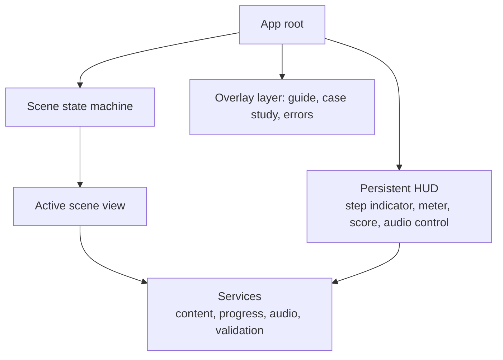

# Feature — Application Shell

## Purpose

One HTML document, five scenes, no navigation that leaves the page — including the post-quiz reset, which the proposal specifies as "tanpa memuat ulang aplikasi (no reload redirected)".

## Behaviour

- Scene switching is in-memory state, not document navigation (REQ-F-001).
- Cold start: every home element fades in together over 0.5 s; nothing blocks first paint; no opening video (REQ-F-028).
- A persistent progress indicator "Langkah N dari M" is visible across scenes (REQ-F-018). `M` is contested — [[Open-Questions]].
- Scene state survives an overlay: opening the guide from home must not destroy stage state (REQ-UX-002).
- No server runtime is required for any function (REQ-TECH-001); all asset URLs are relative so the identical build runs from `file://` and from an origin (REQ-TECH-003).

## Structure

## Constraints

- URL routing is optional. A hash route helps debugging and deep-linking but must not be required, since `file://` deep links behave inconsistently. Decision deferred to [[ADR-001-Single-Page-Application]].
- The shell is what the service worker precaches (REQ-PWA-003) — keep it small and independent of content ([[PWA-Architecture]]).

## Acceptance

1. Navigating all five scenes and pressing `[DESAIN ULANG]` produces zero document loads after the first.
2. The same build directory opens successfully both by double-clicking `index.html` and when served over HTTP.
3. Home is interactive within the [[Non-Functional-Requirements]] performance target.

## Related

- [[Application-Architecture]] · [[Navigation]] · [[Scene-01-Home-and-Guide]]
