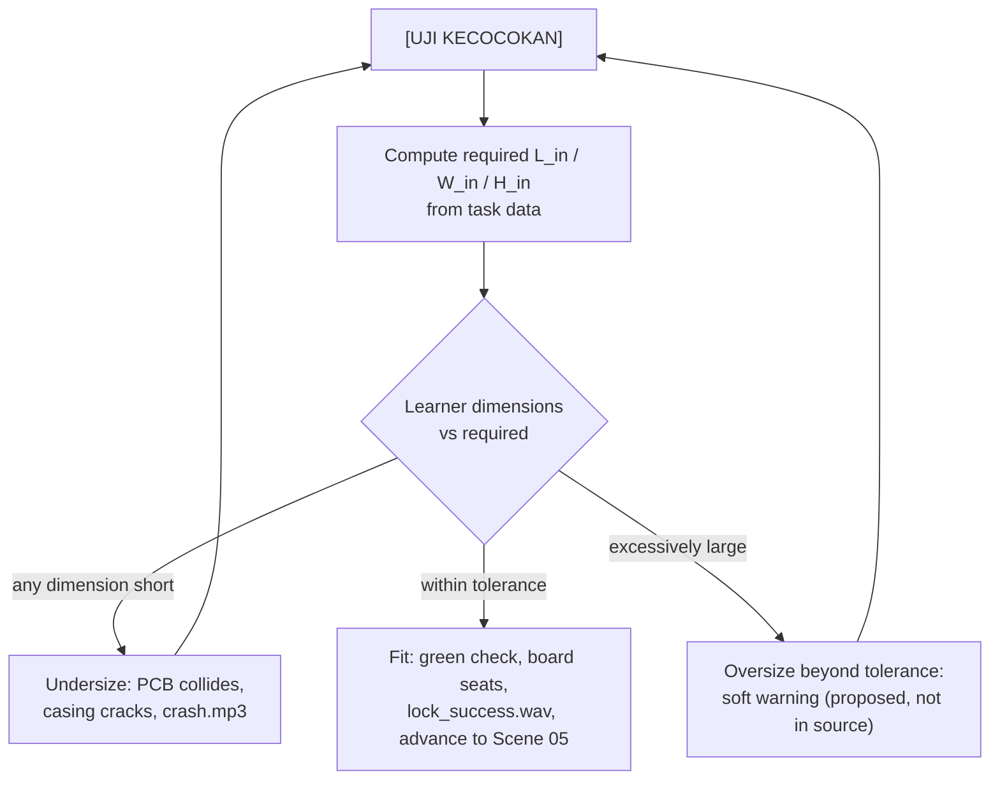

# Feature — Casing Modeller

Stage 3 mechanics. Content and formulas: [[Stage-3-Casing-Dimensions]]. Screen: [[Scene-04-Stage-3-3D-Casing]]. Rendering approach: [[ADR-006-3D-Rendering-Approach]].

## Surfaces

| Surface | Behaviour |
| --- | --- |
| 3D casing model | Box, slow constant auto-rotate, manual click-drag orbit, live resize from sliders |
| PCB reference | The Stage-2 board displayed beside it |
| Three sliders | Panjang, Lebar, Tinggi in mm, live numeric readout |
| Task data panel | PCB size, standoff, tallest component, wall thickness — per the recommendation in [[Stage-3-Casing-Dimensions]] |
| `[UJI KECOCOKAN]` | Runs the fit test; pulsing neon on hover |

## Fit test

The undersize branch must identify *which* dimension failed so the animation collides on the correct axis — a short height means the lid hits the tallest component, not the wall.

## Rendering constraint

Stage 3 is the only feature requiring 3D. Since WebGL cannot be assumed on old lab hardware (REQ-NF-006) and the 25 MB budget is tight (REQ-NF-001), the rendering approach is an open decision with a real non-WebGL candidate — see [[ADR-006-3D-Rendering-Approach]]. The geometry needed is a parametric box with a visible interior and a separable lid; that is achievable with CSS 3D transforms if WebGL is ruled out.

## Open

- Which of the four variables the learner manipulates (blocks slider spec).
- Whether the enclosed board comes from Stage 2 or a fixed constant.
- Whether oversize fails, warns, or passes.

## Acceptance

1. Sliders resize the model within one frame of input.
2. A dimension set computed with the [[Stage-3-Casing-Dimensions]] formulas passes; every under-dimension fails on the correct axis.
3. Orbit works with mouse drag and touch drag; a keyboard alternative exists (REQ-UX-004).
4. Stage 3 remains usable on a device without WebGL, or the fallback is explicitly documented as unavailable and detected gracefully.

## Related

- [[Stage-3-Casing-Dimensions]] · [[Feature-Results-Dashboard]] · [[3D-Rendering-Options]]
