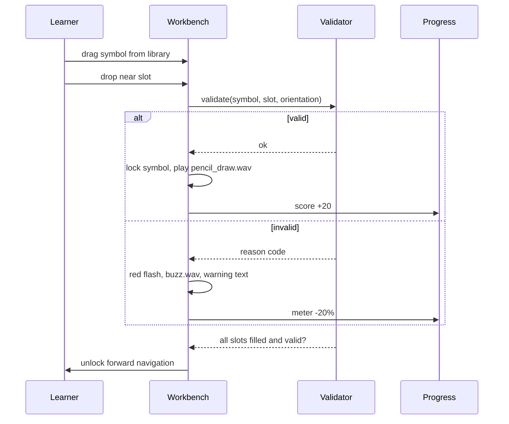

# Feature — Schematic Workbench

Stage 1 mechanics. Content and validation rules: [[Stage-1-Schematic-Standards]]. Screen: [[Scene-02-Stage-1-Schematic]].

## Surfaces

| Surface | Behaviour |
| --- | --- |
| A4 sheet | Framed empty sheet with an empty etiket in the lower-right corner; drop target |
| Component library | Right-hand rack of IEC/ANSI symbols; hover shows a yellow outline glow |
| Etiket form | Project data fields including drawing scale; validated |
| HUD | Step indicator, score, Standardisasi Meter |

## Placement model

> Source: Engineering Decision, derived from Main §Scene 02 + Revision §Stage 1

A free-pixel canvas cannot be validated against "logical circuit position" in any defensible way. Proposal: a **snap grid of named slots** per circuit task — each task's content declares slots (`source+`, `r1`, `led1_anode`, `node_a`, …), each with an accepted component type and orientation. A drop lands in the nearest slot within a radius; validity is then a table lookup, deterministic and unit-testable (REQ-TECH-005).

This keeps the drag & drop mechanic the proposal specifies while making "posisi koordinat sirkuit logis" a real, checkable predicate.

## Etiket validation — REQ-F-006

Fields and their rules come from content, not code. The one rule stated explicitly: a scale invalid for the sheet size (example given: 5:1 on A4) is rejected with the standard failure choreography.

## Input parity

Mouse drag, touch drag and a keyboard path (select symbol → select slot → confirm) must all reach the same validator (REQ-UX-003, REQ-UX-004). Three students sharing one machine also means drag must tolerate imprecise, fast input — hence generous snap radii.

## Open

- Three circuit tasks in one stage: sequential, or selectable? Affects the step counter and scoring split. → [[Open-Questions]]
- Whether distractor symbols (capacitor, transistor) appear in the library. Recommended yes — they carry LO-2.

## Acceptance

1. Each of the three circuits can be completed, and each defined failure mode produces its choreography.
2. Validation runs without a DOM in unit tests.
3. All three input modalities complete a circuit.

## Related

- [[Stage-1-Schematic-Standards]] · [[Feedback-Model]] · [[Feature-PCB-Router]]
