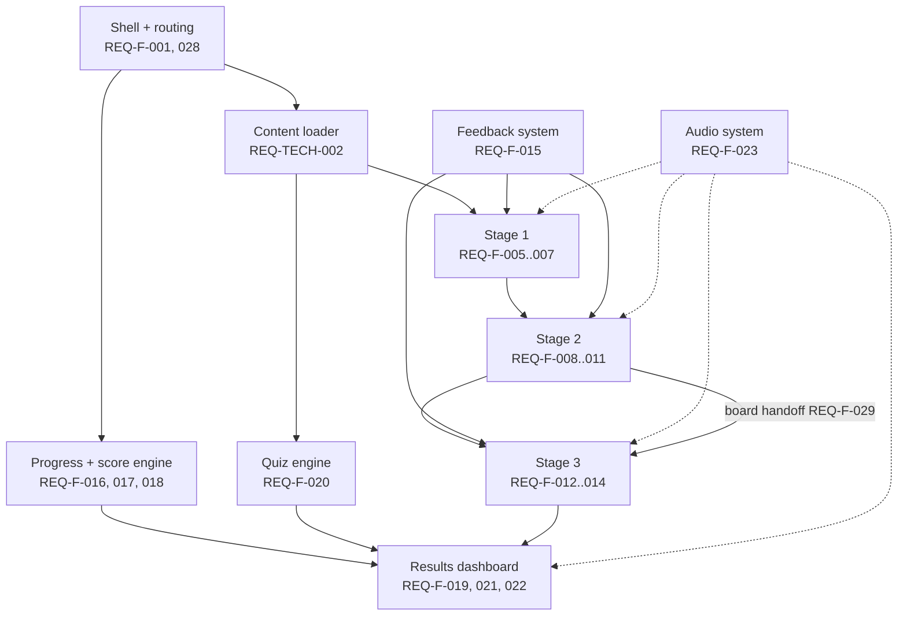

# Functional Requirements

Grouping and dependency view of the `REQ-F-*` set. Requirement text is not repeated — see [[Requirements-Matrix]] §F.

## Groups

| Group | IDs | Feature note |
| --- | --- | --- |
| Shell and navigation | REQ-F-001, 002, 018, 028 | [[Feature-Application-Shell]] |
| Reference material | REQ-F-003, 004 | [[Feature-Guide-and-Case-Study]] |
| Stage 1 mechanics | REQ-F-005, 006, 007 | [[Feature-Schematic-Workbench]] |
| Stage 2 mechanics | REQ-F-008, 009, 010, 011, 029 | [[Feature-PCB-Router]] |
| Stage 3 mechanics | REQ-F-012, 013, 014 | [[Feature-Casing-Modeller]] |
| Feedback and progress | REQ-F-015, 016, 017, 018 | [[Feedback-Model]], [[Feature-Scoring-and-Progress]] |
| Assessment | REQ-F-020 | [[Feature-Quiz-Engine]] |
| Results and reward | REQ-F-019, 021, 022, 027 | [[Feature-Results-Dashboard]] |
| Presentation polish | REQ-F-023, 024, 025 | [[Feature-Audio-System]] |
| Compliance | REQ-F-026 | [[Feature-Results-Dashboard]] |

## Dependency order

Build order follows this graph — see [[Roadmap]].

## Cross-stage invariants

> Source: Engineering Decision, derived from the requirement set

1. **One progress record.** Stage validations, item answers, meter and score all write to a single state object, persisted per [[Data-Architecture]].
2. **Stages are pure functions of content + learner input.** No stage may hard-code its own values; all come from the content pack (REQ-TECH-002).
3. **Validation is separable from rendering** (REQ-TECH-005) — every rule in [[Stage-1-Schematic-Standards]], [[Stage-2-PCB-Trace-Width]] and [[Stage-3-Casing-Dimensions]] must be unit-testable without a DOM.
4. **Reset is total** (REQ-F-022): `[DESAIN ULANG]` clears progress, score, meter and stage models without a page reload.

## Requirements that need a decision before implementation

| ID | Blocked on |
| --- | --- |
| REQ-F-008, REQ-F-009 | Slider range and tolerance — [[Stage-2-PCB-Trace-Width]] |
| REQ-F-012, REQ-F-014 | Which casing variables the learner controls — [[Stage-3-Casing-Dimensions]] |
| REQ-F-017, REQ-F-019 | Score mapping and star/badge thresholds — [[Assessment-Strategy]] |
| REQ-F-018 | Step count ("dari 4" vs "dari 5", plus three Stage-1 tasks) — [[Open-Questions]] |
| REQ-F-020 | Whether keys ship client-side — [[Proposal-Comparison]] CH-05 |
| REQ-F-021 | Certificate format offline — [[Open-Questions]] |
| REQ-F-027 | Data behind the trace-temperature curve is not supplied by either document |

## Related

- [[Requirements-Matrix]] · [[Features]] · [[Main-Learning-Flow]] · [[Functional-Testing]]
