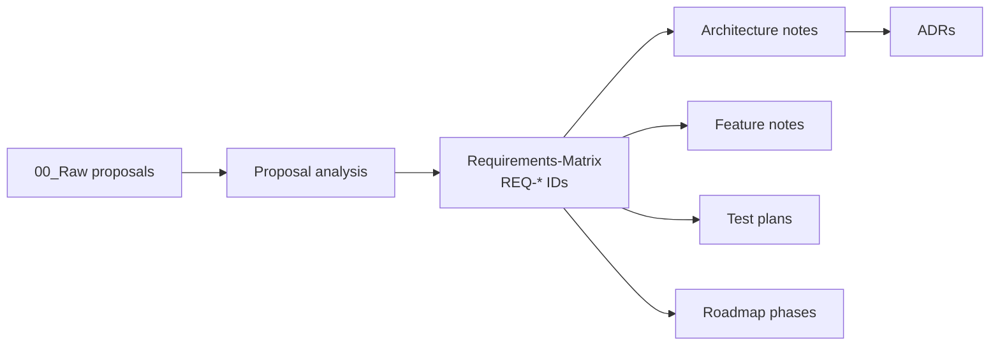

# Requirements

Entry point for requirements. **No requirement text is duplicated here** — the authoritative table with IDs, sources, priorities and statuses is [[Requirements-Matrix]].

## How requirements are organised

| Category | Prefix | Note |
| --- | --- | --- |
| Educational | `REQ-EDU-` | What must be taught and assessed — [[Learning-Objectives]] |
| Functional | `REQ-F-` | What the application does — [[Functional-Requirements]] |
| Non-functional | `REQ-NF-` | Qualities and constraints — [[Non-Functional-Requirements]] |
| PWA / offline | `REQ-PWA-` | Installability and offline behaviour — [[PWA-Architecture]], [[Offline-Strategy]] |
| UX | `REQ-UX-` | Interaction and access constraints — [[UX-Principles]] |
| Technical | `REQ-TECH-` | Implementation-level obligations — [[Application-Architecture]] |

## Source classification

Every requirement declares one of four sources. This distinction is load-bearing — a future developer must be able to tell an approved obligation from a team choice.

| Source | Meaning | Changeable by |
| --- | --- | --- |
| `Approved Proposal` | Stated in `TMR_TLEKTRO_4_Proposal…docx` | Only by a new approved revision |
| `Approved Revision` | Stated in `Revisi Materi_TE.docx`; wins on conflict | Only by a new approved revision |
| `Project Brief` | Given by the documentation task (web, local-first, PWA, offline, responsive, landscape, deployable, one codebase) | Project owner |
| `Engineering Decision` | Derived by the team; must point at an ADR or a design note | The team, via a new ADR |

## Traceability chain

Rule: a feature note, a test case or a roadmap deliverable that cites no `REQ-` ID is either missing traceability or is scope creep.

## Coverage summary

88 requirements. Counts and source split: [[Requirements-Matrix]] §Counts. Nothing is `Done` — no application code exists yet.

## Related

- [[Requirements-Matrix]] · [[Scope]] · [[Roadmap]] · [[Open-Questions]]
