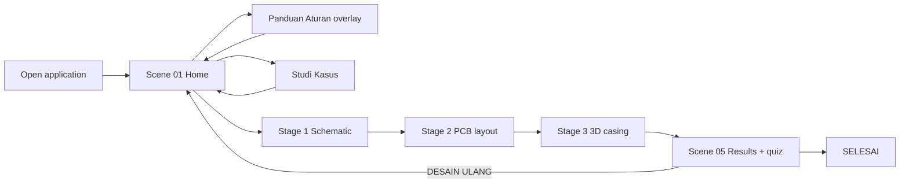
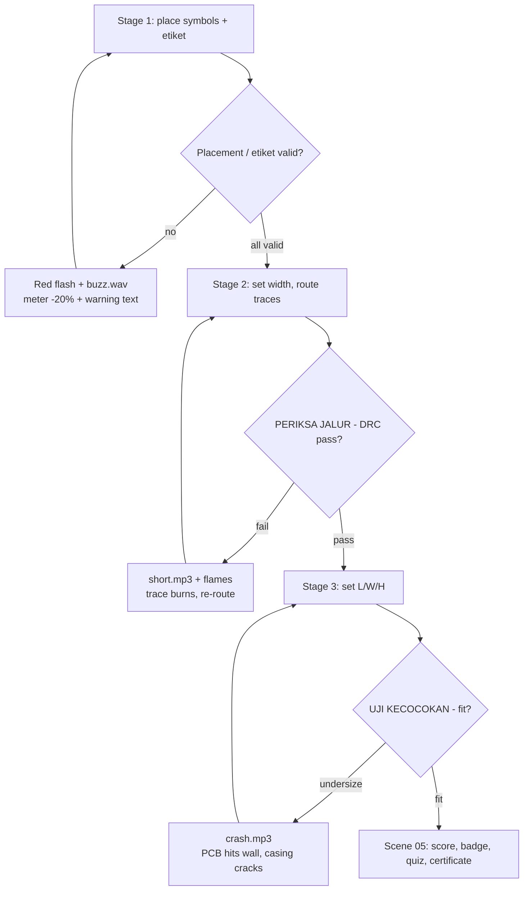
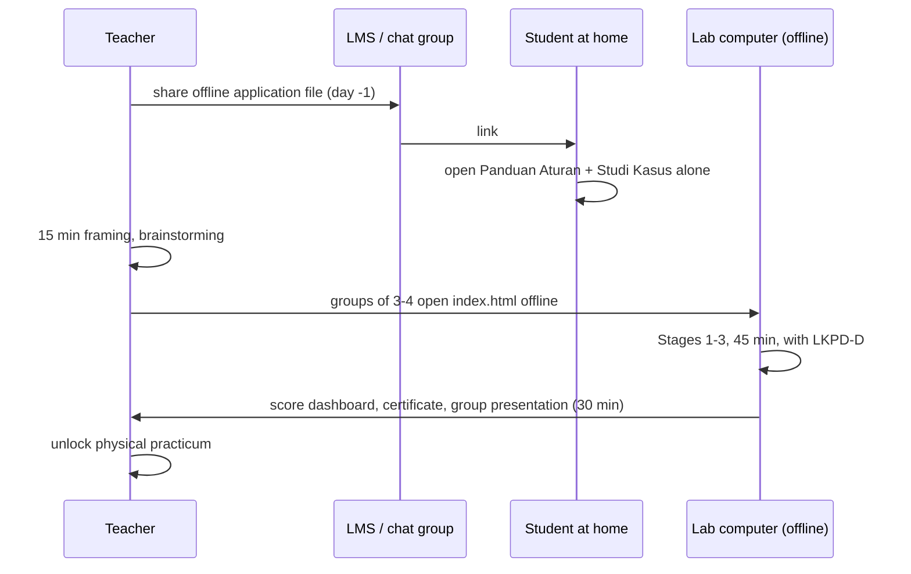

# Main Learning Flow

The complete learner path including failure branches. Screen detail: [[Screens]]. Stage gating rules: [[Learning-Architecture]].

> Source: Approved Proposal — Sections `ALUR INTERAKSI`, `STORYBOARD` Scenes 01–05

## Happy path

## With failure branches

Note what the source does *not* define: any exit from a failure loop. There is no skip, no hint escalation, and no stated behaviour when the Standardisasi Meter hits 0%. A group can, as specified, loop indefinitely inside Stage 2 — which is a real risk inside a 45-minute lesson. See [[Feedback-Model]] §Anti-frustration and [[Open-Questions]].

## Session context flow

How the app is used across the lesson (REQ-EDU-019):

This flow drives REQ-NF-003, REQ-PWA-010 and REQ-EDU-022: the home run and the lab run are different environments — likely a student phone or home PC with internet, and an offline lab desktop — and both must work from the same build ([[Deployment-Architecture]]).

## Related

- [[Navigation]] · [[Curriculum]] · [[Screens]] · [[Offline-Strategy]]
