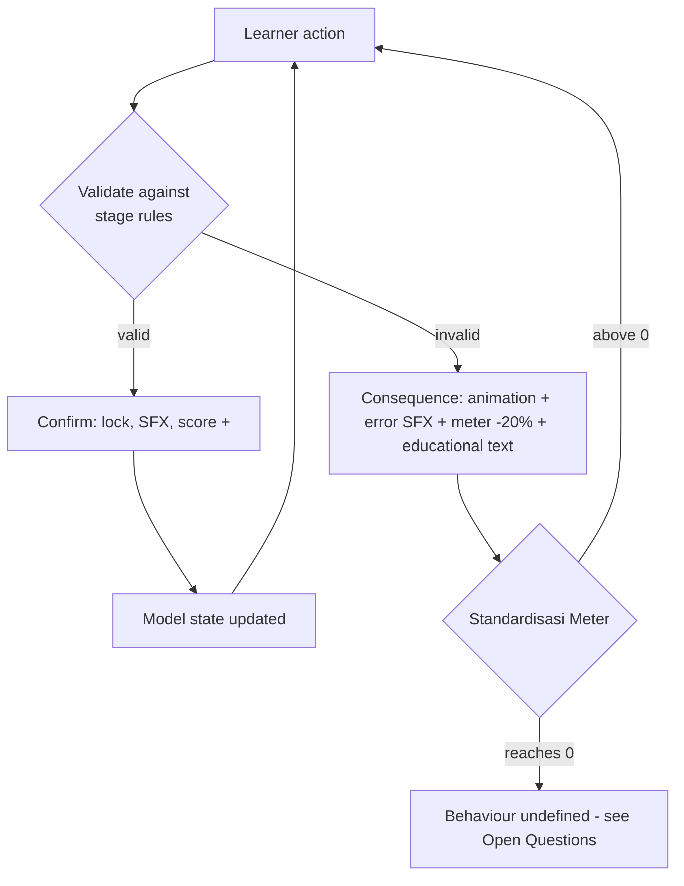

# Feedback Model

Specification of **Immediate Dynamic Feedback** — the named mechanic of this product (REQ-EDU-015, REQ-F-015, REQ-F-016).

> Source: Approved Proposal — Sections `DESKRIPSI UMUM`, `RENCANA IMPLEMENTASI`, `STORYBOARD` Scenes 02–04

## Principle

An invalid decision does not produce a verdict; it produces the **manufacturing failure that decision would have caused**, immediately, in the simulation. The learner reads the consequence, then infers the rule.

## Per-stage consequence table

| Stage | Invalid action | Consequence (verbatim intent) | Audio | Meter |
| --- | --- | --- | --- | --- |
| 1 | Reversed diode symbol; invalid etiket scale (e.g. 5:1 on A4) | Red screen flash + educational warning text | `buzz.wav` | −20% |
| 1 | Valid placement | Symbol locks permanently, score +20 | `pencil_draw.wav` | — |
| 2 | Trace too thin for the load; 90° corner | Flames along the copper, trace burns/breaks from induced overcurrent; learner must re-route | `short.mp3` | not stated |
| 2 | Valid route | Clean digital connection | `connect.wav` | — |
| 3 | Casing smaller than required (e.g. L = 80 mm for a 100 mm board) | PCB slams into the shell wall, casing cracks; error status shown | `crash.mp3` | not stated |
| 3 | Correct fit | Green check, board seats perfectly, auto-advance to Scene 05 | `lock_success.wav` | — |
| 5 | Correct quiz answer | Green check beside the option | `bell.wav` | — |

Only Stage 1 has an explicit meter penalty in the source. Whether Stages 2 and 3 also deduct is **To Be Decided** — [[Open-Questions]]. Consistency argues yes.

## The educational text requirement

Scene 02 requires "teks peringatan edukatif" alongside the red flash. This is the part that carries the learning: the animation shows *that* it failed, the text says *why*. It is not written in either document for any stage. Authoring one message per failure mode is a content task — schema field `feedback.explanation` in [[Content-Architecture]].

Failure modes needing a message: reversed polarity, wrong topology, invalid scale, incomplete etiket, trace under-width, 90° corner, unconnected pad, casing under-length/width/height, and (if adopted) casing over-loose.

## Accessibility constraint

> Source: Engineering Decision — REQ-UX-007, [[Accessibility]]

Every failure signal must exist in **three channels**: visual event, text message, audio cue. No failure may be communicated by colour alone (red flash) or audio alone (buzz) — a muted lab computer is the normal case, not an edge case, when 3–4 students share one machine.

## Anti-frustration rules

> Source: Engineering Decision

1. Consequence animations must be **skippable after first viewing** — a learner retrying the same failure three times should not watch a 3-second fire animation each time. Cap: play in full once per failure mode per session, abbreviated thereafter.
2. A failure must never destroy valid prior work. Stage 1 locks valid placements permanently, which already satisfies this; Stage 2 must not clear correct traces when one route fails.
3. The meter must be recoverable or the run must remain completable at 0% — otherwise a 45-minute group session can dead-end at minute 12. Decide with the meter-exhaustion question.

## Related

- [[Learning-Architecture]] · [[Assessment-Strategy]] · [[UI-States]] · [[Media-Asset-Register]]
