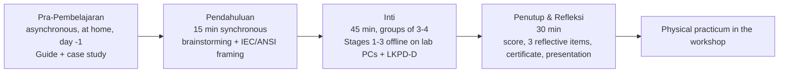

# Curriculum

The teaching sequence, mapped to screens and requirements. Shape is defined in [[Learning-Architecture]]; values live in the three stage notes.

## Sequence

| # | Segment | Screen | Content note | Assessed |
| --- | --- | --- | --- | --- |
| 0a | Studi Kasus — assembly failure from a tolerance miscalculation | Scene 01 | [[Scene-01-Home-and-Guide]] | No (trigger) |
| 0b | Panduan Aturan — paper sizes, line thickness, etiket, manual instruments | Scene 01 overlay | [[Stage-1-Schematic-Standards]] §Standards reference | No (reference) |
| 1 | Stage 1 — Standardisasi Skema Manual | Scene 02 | [[Stage-1-Schematic-Standards]] | 9 items + placement validation |
| 2 | Stage 2 — CAD PCB Layout | Scene 03 | [[Stage-2-PCB-Trace-Width]] | 3 items + DRC validation |
| 3 | Stage 3 — 3D CAD Casing | Scene 04 | [[Stage-3-Casing-Dimensions]] | 6 items + fit validation |
| 4 | Evaluasi — score, badge, reflective quiz, certificate | Scene 05 | [[Assessment-Strategy]] | 3 reflective items |

> Source: Approved Proposal — Sections `ALUR INTERAKSI`, `STORYBOARD`; Approved Revision — Sections `STAGE 1/2/3`

## Lesson-plan alignment

> Source: Approved Proposal — Section `RENCANA IMPLEMENTASI`

Implications the build must honour: the guide and case study are usable standalone with no stage progress (REQ-EDU-022); three stages must be completable inside 45 minutes by a group sharing one screen (REQ-EDU-020); the closing screen must give the group something to present — the score breakdown and the casing-vs-PCB conclusion.

## Time budget — engineering estimate

> Source: Engineering Decision

45 minutes across three stages plus three Stage-1 tasks is tight. Working target: Stage 1 ≈ 18 min (3 circuits), Stage 2 ≈ 12 min, Stage 3 ≈ 12 min, transitions ≈ 3 min. This is a **design constraint on task count and retry friction**, not a proposal fact — validate in [[Usability-Testing]]. If Stage 1 overruns, the candidate lever is making circuits 2 and 3 optional/bonus rather than cutting validation depth.

## Competency mapping

The score bands named in Scene 05 are the de-facto competency list:

| Competency | Band | Stage | Objectives |
| --- | --- | --- | --- |
| Standardisasi Skema | 25 | 1 | LO-1, LO-2 |
| PCB Layout | 30 | 2 | LO-3, LO-4 |
| 3D Casing | 20 | 3 | LO-5 |
| Evaluasi Kuis | 25 | closing | LO-6 |

> Source: Approved Proposal — Section `STORYBOARD` Scene 05 (example totals 24/25, 28/30, 20/20, 20/25 = 92/100)

Objective definitions: [[Learning-Objectives]]. How the 18 revision items map into these bands is **To Be Decided** — [[Assessment-Strategy]].

## Related

- [[Learning-Objectives]] · [[Learning-Outcomes]] · [[Assessment-Strategy]] · [[Question-Bank]]
