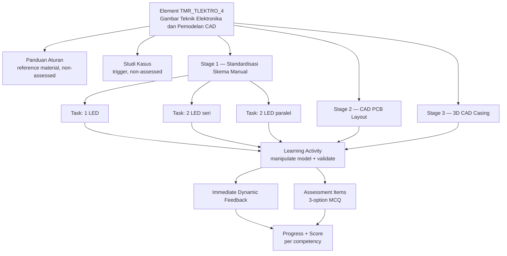
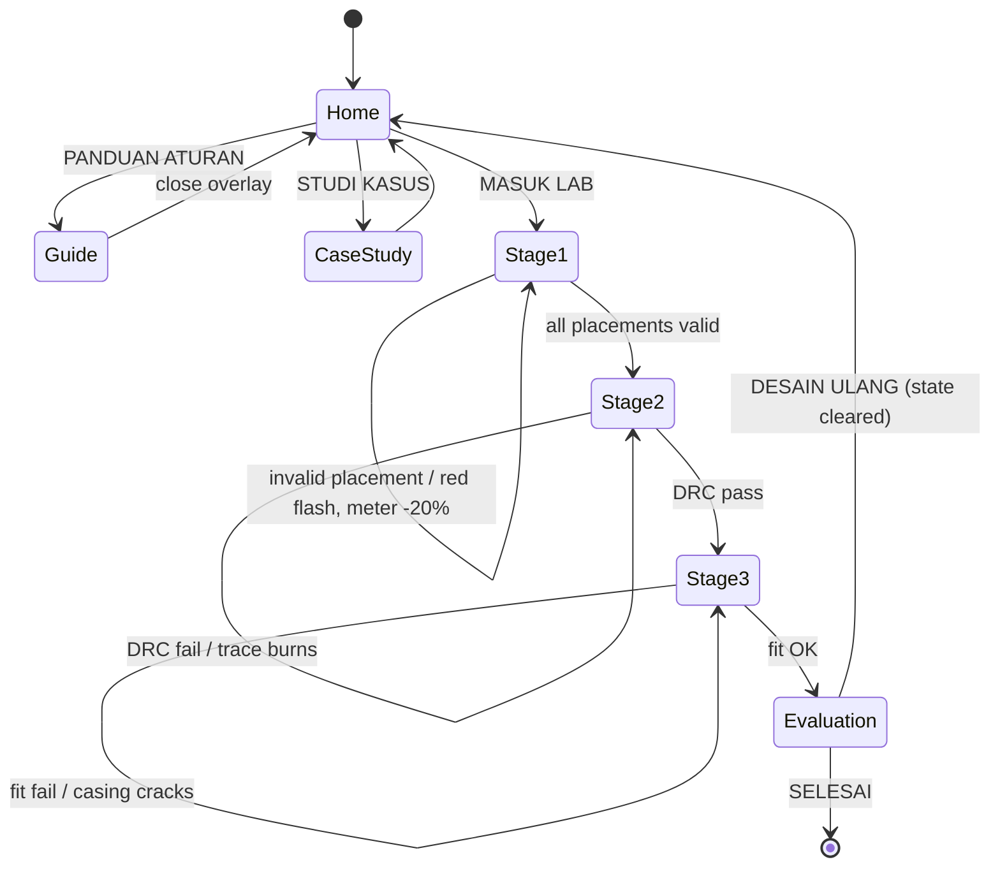

# Learning Architecture

How educational content is structured, and how a learner's path through it is represented. Content *values* live in the stage notes; this note defines the shape.

## Hierarchy

The two approved documents describe a flat, single-course structure. There is no "course catalogue", no multiple modules, no unit above the element. Represented honestly:

> Source: Approved Proposal — Sections `DESKRIPSI UMUM`, `ALUR INTERAKSI`; Approved Revision — Sections `STAGE 1/2/3`

Deliberately *not* modelled: `Course → Module → Lesson` chains that neither document contains. If the material later grows past this element, the content schema in [[Content-Architecture]] already allows a level above `stage`.

## The two activity types

| Type | Where | Shape |
| --- | --- | --- |
| **Manipulative activity** | Every stage | The learner changes model variables (symbol position, trace width, three dimensions) and submits for validation. Failure has a visual consequence and costs standardisation-meter points. |
| **Assessment item** | 18 stage-embedded + 3 closing | Three-option multiple choice with a single key, plus a teacher explanation. |

Both feed one progress record. Neither document specifies whether a wrong MCQ answer also reduces the standardisation meter — **To Be Decided**, [[Open-Questions]].

## Progression rule

Stages are strictly sequential and gated by validation: Stage 1 unlocks forward movement only when all placements are valid; Stage 2 advances only on a DRC pass; Stage 3 advances only on a successful fit test, at which point it auto-transitions to Scene 05.

> Source: Approved Proposal — Sections `ALUR INTERAKSI`, `STORYBOARD` Scenes 01–05

The guide is reachable non-linearly from home; whether it is reachable *from inside a stage* is not stated — [[Navigation]] proposes it, flagged as an engineering decision.

## Multimedia's pedagogical role

Media is not decoration in this design; each channel carries information.

| Channel | Function | Example from the proposal |
| --- | --- | --- |
| Visual consequence | Shows the failure the drawing would cause | Burning trace, cracking casing, red flash |
| Diegetic SFX | Confirms or denies an action instantly | `pencil_draw.wav` on valid placement, `buzz.wav` on error, `connect.wav` on a joined trace |
| Music | Sets cognitive register per stage, ducked during work | `drawing_theme.mp3` 15% → 10%, `routing_focus.mp3` 12%, `cad_tension.mp3` 12% |
| Ambience | Situates the learner in a studio/lab/workshop | `studio_ambience.mp3`, `pc_fan_hum.mp3`, `3d_printer.mp3` |
| Reward | Marks competency attainment | `applause.wav`, gold particles, badge |

Because audio carries meaning, REQ-UX-007 requires every failure to be signalled visually *and* textually too — a muted or hearing-impaired learner must lose nothing. See [[Accessibility]].

## Pedagogical framing

Neither document names a learning theory, model or syllabus framework (no "PBL", "discovery learning", "TPACK", etc.). None is asserted here. What the documents *do* specify behaviourally: prior independent exploration, a trigger case, guided group experimentation, immediate consequence-based feedback, formative scoring, reflective quizzing, and group presentation of a derived conclusion. Naming a formal model is **To Be Decided** — it is a reporting/academic need, not a build blocker.

## Related

- [[Curriculum]] · [[Learning-Objectives]] · [[Learning-Outcomes]]
- [[Assessment-Strategy]] · [[Feedback-Model]] · [[Question-Bank]]
- [[Content-Architecture]] · [[Data-Architecture]]
