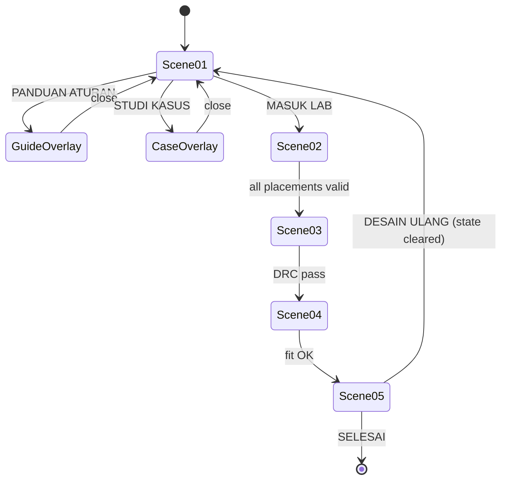

# Navigation

## Model

Two navigation planes:

| Plane | Contents | Rule |
| --- | --- | --- |
| **Scene plane** | Scene 01 → 02 → 03 → 04 → 05 | Sequential and gated by validation |
| **Overlay plane** | Panduan Aturan, Studi Kasus, error/offline notices | Non-modal to progress; never destroys scene state |

> Source: Approved Proposal — Sections `ALUR INTERAKSI`, `STORYBOARD` Scene 01 ("navigasi non-linear tanpa reload halaman eksternal")

## Rules

1. **No backward scene navigation is specified.** Neither document defines a "back" control inside the stages. Proposed (Engineering Decision): allow read-only review of a completed stage, never re-scoring. Undecided — [[Open-Questions]].
2. **Guide access from inside a stage.** The proposal only places the guide on home, but a learner blocked at Stage 2 needs the line-thickness table. Proposed: a persistent HUD button opening the guide as an overlay above any scene, preserving stage state (REQ-UX-002). Engineering Decision.
3. **Reset returns to Scene 01 in a clean state, without a reload** (REQ-F-022).
4. **No browser-level navigation is required.** Back-button and deep-link behaviour must not be load-bearing, because the `file://` distribution handles them inconsistently ([[Feature-Application-Shell]]).
5. **The step indicator is the wayfinding element** — "Langkah N dari M" persists across scenes (REQ-F-018). Its total is contested — [[Open-Questions]].

## Home screen buttons

The flowchart specifies three (Studi Kasus, Panduan Aturan, Masuk Lab); the Scene 01 storyboard draws two (`btn_masuk_lab`, `btn_panduan`). Both are approved. Proposed resolution: three buttons — [[Feature-Guide-and-Case-Study]].

## Input parity

Every navigation action is reachable by mouse, touch and keyboard (REQ-UX-003, REQ-UX-004). Focus order follows visual order; the overlay traps focus while open and returns it on close.

## Related

- [[Main-Learning-Flow]] · [[Screens]] · [[UX-Principles]] · [[Feature-Application-Shell]]
