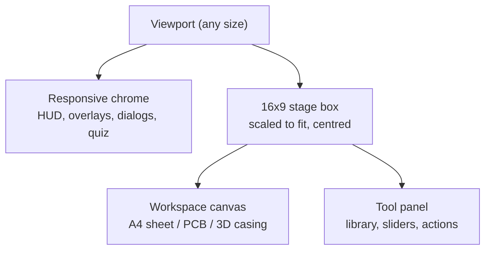

# Responsive Design

Reconciles two requirements that pull apart: a **fixed 16×9 design** (REQ-NF-002, from the proposal) and a **responsive layout** (REQ-NF-008, from the brief).

## Approach — scaled fixed stage inside responsive chrome

> Source: Engineering Decision — [[ADR-009-Landscape-First-Layout]]

The workspace (canvas + tool panel) is authored at one 16×9 aspect and scaled to fit the viewport; the surrounding chrome (HUD, overlays, quiz, results) uses ordinary responsive layout. This preserves the storyboard's spatial composition — where a slider sits relative to a board matters pedagogically — without letterboxing the whole application.

## Breakpoints

| Class | Width (landscape) | Layout |
| --- | --- | --- |
| Desktop / lab PC | ≥ 1280 px | Primary target. Canvas left, tool panel right, HUD top. Full media. |
| Small desktop / large tablet | 1024–1279 px | Same structure; tool panel narrows, library becomes a two-column rack |
| Tablet | 768–1023 px | Same structure; tool panel collapses to an expandable drawer; larger hit targets |
| Phone landscape | 480–767 px | Reduced chrome, HUD compresses to icons + step counter; 3D orbit gestures take priority over page scroll |
| Any portrait | — | Portrait guard — [[Landscape-Design]] |

Widths are an engineering proposal; validate against the real lab inventory ([[Open-Questions]]).

## Scaling rules

1. Scale the stage by `min(vw / 16, vh / 9)`; never crop the workspace.
2. Text inside the stage scales with it, with a **floor** — below ~14 px effective, switch that text to the responsive chrome instead of shrinking further (P-3 in [[UX-Principles]]).
3. Hit targets never scale below 44 × 44 CSS px, regardless of stage scale.
4. Raster art is authored at 1920×1080 and downscaled; it is never upscaled beyond 1×.
5. The 3D viewport resolution follows device pixel ratio, capped for performance on weak lab GPUs.

## What must not change across sizes

Every mechanic and every piece of content. There is no "mobile version" with fewer stages — one codebase, one content set (REQ-NF-010).

## Related

- [[Landscape-Design]] · [[UX-Principles]] · [[Non-Functional-Requirements]] · [[Usability-Testing]]
