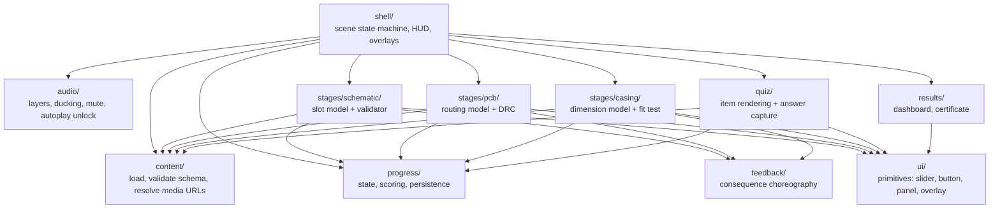

# Application Architecture

`Status: Proposed` · Stack undecided — [[ADR-002-Frontend-Stack]]. Everything below is stack-agnostic on purpose.

## Module map



## The rule that matters most

**Every stage splits into a pure domain model and a view** (REQ-TECH-005).

```text
stages/pcb/
  model.ts        pure: pads, segments, width, copper weight -> DRC result
  model.test.ts   runs with no DOM, no canvas, no framework
  view.*          renders the model, captures input, plays consequences
```

Why this is non-negotiable here: the domain rules are *the curriculum*. `width = current × factor`, `L_in = L_PCB + 2×clearance`, LED polarity, series vs parallel — these are assessed learning outcomes. If they live inside event handlers they cannot be tested, and a silent regression becomes a teaching error delivered to a classroom.

Each model is a pure function of `(task content, learner input) → validation result`, where a result carries located violations with reason codes, not booleans:

```json
{
  "valid": false,
  "violations": [
    { "code": "TRACE_TOO_THIN", "at": "seg-3", "expected": 5.0, "actual": 1.2 },
    { "code": "CORNER_90", "at": "seg-5" }
  ]
}
```

Reason codes drive three things at once: the consequence animation, the educational text ([[Feedback-Model]]) and the accessibility announcement ([[Accessibility]]).

## State ownership

| State | Owner | Lifetime |
| --- | --- | --- |
| Current scene | shell | session |
| Stage working model (placements, traces, dimensions) | the stage module | until stage completion or reset |
| Progress, score, meter, answers | `progress/` | persisted — [[Data-Architecture]] |
| Preferences (mute, motion) | `progress/` | persisted, survives reset |
| Loaded content | `content/` | app lifetime, immutable |

One-way flow: views dispatch intents, models validate, progress records, views re-render from state. No stage writes another stage's state — the Stage 2 → Stage 3 handoff (REQ-F-029) goes through progress.

## Content loading

`content/` loads the pack, validates it against the schema ([[Content-Architecture]]), and fails loudly at startup rather than at Stage 3 in front of a class. Resolution of media URLs is relative in both topologies (REQ-TECH-003).

## Error boundaries

Per scene. A crash in Stage 3's renderer must not destroy the recorded progress of Stages 1 and 2 — the boundary offers a retry and, failing that, a jump to the results with what was earned ([[UI-States]]).

## Testing hooks

- Domain models: unit tests, no DOM ([[Functional-Testing]]).
- Content pack: schema validation in CI ([[Educational-Testing]]).
- Scenes: smoke tests driving the state machine.
- Offline: build-artefact tests ([[Offline-Testing]], [[PWA-Testing]]).

## Related

- [[System-Architecture]] · [[Data-Architecture]] · [[Content-Architecture]] · [[ADR-002-Frontend-Stack]]
