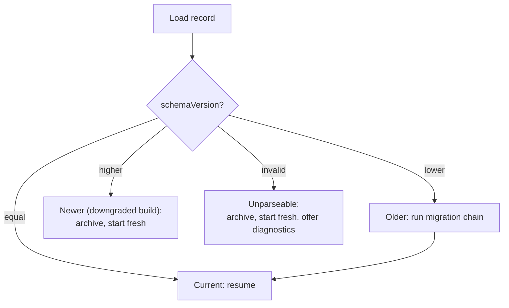

# Data Architecture

`Status: Proposed`. Store choice: [[ADR-004-Local-Persistence]]. Content data is separate and lives in [[Content-Architecture]].

## Data classes

| Class | Mutable | Persisted | Owner |
| --- | --- | --- | --- |
| Content (circuits, tasks, items, scoring config, media manifest) | No — immutable per version | Shipped with the build | [[Content-Architecture]] |
| Progress (run state, score, meter, answers) | Yes | Yes | [[Feature-Scoring-and-Progress]] |
| Preferences (mute, volume, reduced motion) | Yes | Yes, survives reset | shell |
| Stage working model (placements, traces, dimensions) | Yes | Derived — persisted as part of the run | stage modules |
| Session ephemera (hover, animation, focus) | Yes | No | views |

## Progress record

```json
{
  "schemaVersion": 1,
  "runId": "uuid",
  "contentVersion": "1.0.0",
  "startedAt": "2026-08-16T08:00:00.000Z",
  "updatedAt": "2026-08-16T08:31:12.000Z",
  "meter": 80,
  "score": { "skema": 22, "pcb": 0, "casing": 0, "kuis": 0 },
  "stages": {
    "stage1": {
      "status": "done",
      "tasks": {
        "c1-led-tunggal": { "placements": { "s1": "R1", "s2": "LED1" }, "attempts": 1, "failures": [] },
        "c2-led-seri": { "placements": {}, "attempts": 2, "failures": ["LED_REVERSED"] }
      }
    },
    "stage2": { "status": "in_progress", "widthMm": 5.0, "segments": [], "attempts": 0, "failures": [] },
    "stage3": { "status": "locked" }
  },
  "answers": { "Q-S1-01": { "chosen": "B", "correct": true, "at": "…" } },
  "completed": false
}
```

Design notes:
- **One run per record.** A run is the unit of meaning; partial merges across runs are meaningless for a lab exercise ([[Local-First-Architecture]] §Synchronisation).
- **`contentVersion` is stamped at start**, so a mid-run content update is detectable.
- **`failures` stores reason codes**, not messages. Text comes from the content pack, so wording can change without invalidating stored data — and the codes are what [[Educational-Testing]] analyses to find items or tasks that everyone fails.
- **No personal data.** No name, no class, no device identifier, no IP, no timestamps beyond run timing (REQ-NF-011). `runId` is random and local-only.

## Write policy

| Event | Write |
| --- | --- |
| Placement validated | Yes |
| DRC run | Yes |
| Fit test run | Yes |
| Item answered | Yes |
| Meter changed | Yes |
| Scene changed | Yes |
| Slider dragged | No — debounce; only the committed value is meaningful |
| Hover, animation | No |

Writes are debounced (~250 ms) and coalesced, but never deferred past a scoring event ([[Feature-Scoring-and-Progress]]).

## Store selection

| Candidate | Fits | Against |
| --- | --- | --- |
| `localStorage` | Trivial, synchronous, works nearly everywhere including quirky `file://` contexts | ~5 MB cap, synchronous writes on the main thread, string-only |
| **IndexedDB** | Structured, async, larger quota, transactional | More code; behaviour on `file://` varies by browser |
| Cache Storage | Already used for assets | Wrong tool for mutable records |
| OPFS | Modern, fast | Poor support breadth for the target lab hardware |

Proposal: **IndexedDB with a localStorage fallback**, chosen at runtime by capability probe — the fallback exists specifically for E2 `file://` quirks ([[Offline-Strategy]]). The progress record is a few kilobytes, so the 5 MB fallback cap is not a constraint. Decision pending in [[ADR-004-Local-Persistence]].

## Migration



Archived records are kept under a separate key so a diagnostic can inspect them, and are dropped after a bounded count.

## Reset semantics

`[DESAIN ULANG]` (REQ-F-022) deletes the progress record from storage — not just from memory — and preserves preferences. On a shared lab machine, residue from the previous group is a real failure mode, not a theoretical one.

## Related

- [[Local-First-Architecture]] · [[Content-Architecture]] · [[Feature-Scoring-and-Progress]] · [[ADR-004-Local-Persistence]]
