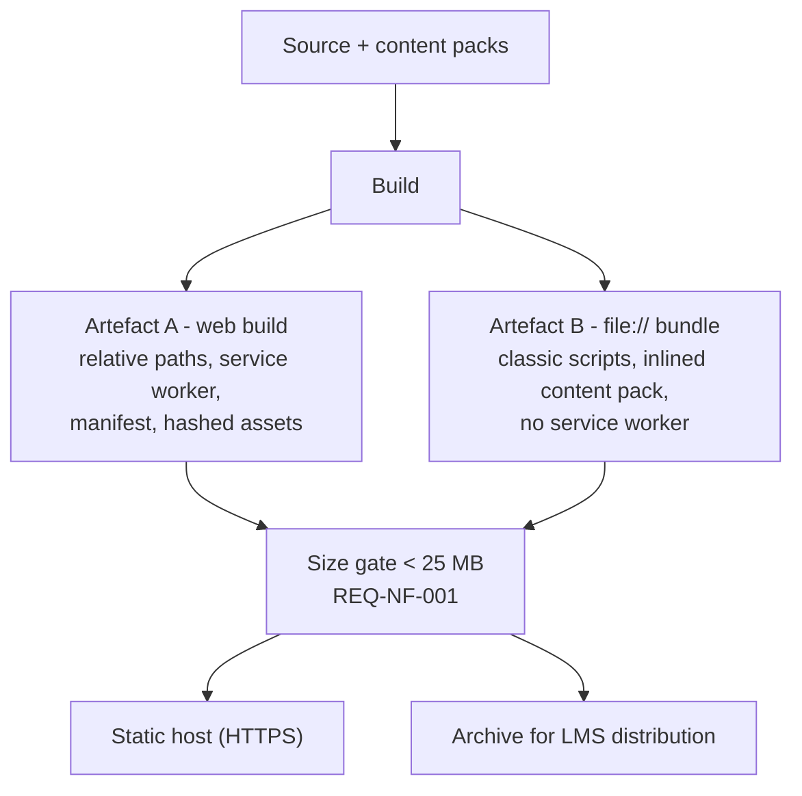

# Deployment Architecture

`Status: Proposed`. Requirements: REQ-TECH-006, REQ-NF-010, REQ-PWA-010, REQ-NF-001.

## Two artefacts, one source

Artefact B is a build *target*, not a fork: same components, same content, same validation code. Its differences are exactly the `file://` constraints listed in [[Offline-Strategy]] — no service-worker registration, classic-script output, inlined content pack, no absolute paths.

## Hosting

Any static host (GitHub Pages, Netlify, Cloudflare Pages, a school server). Requirements: HTTPS for installability, correct MIME types, and a sub-path-safe base URL since school deployments often land under `/e-drawlab/`. No server runtime, no build step at request time, no environment variables, no secrets — there are none to leak.

Caching headers: hashed assets immutable and long-lived; `index.html`, the manifest and the service worker short-lived or `no-cache`, so an update is actually discovered ([[PWA-Architecture]] §Update strategy).

## Versioning and visibility

Every artefact displays its build version and content-pack version in the UI — proposed location: the Scene 01 licence/info affordance. Reason: in E2 there is no update channel, so "which copy is this lab running?" is a question a teacher must be able to answer without a developer ([[Offline-Strategy]]).

## Release checklist

- [ ] Size gate passed (< 25 MB, both artefacts)
- [ ] Content pack schema-valid; every `source` field populated
- [ ] Artefact B opens by double-clicking `index.html` on Windows, all stages completable
- [ ] Artefact A installs and runs fully offline after install ([[PWA-Testing]])
- [ ] Version strings visible and correct
- [ ] Attribution line and licence icon present (REQ-F-026)
- [ ] No developer identity on the front page (REQ-NF-007)
- [ ] No credentials, tokens or personal data anywhere in the artefacts

## Environments

| Environment | Purpose | Notes |
| --- | --- | --- |
| Local dev | Build and test | Must also be exercised as `file://`, not only through the dev server |
| Preview | Review builds | Optional |
| Production (hosted) | E1/E3 — [[Offline-Strategy]] | HTTPS, stable URL |
| Distribution archive | E2 | Named with version, sized for LMS upload |

## CI

> Source: Engineering Decision

Minimum pipeline: unit tests for the domain models, content-pack schema validation, both artefact builds, size gate, and a `file://` smoke test in a headless browser. The `file://` smoke test is the one most likely to be skipped and the one most likely to catch a classroom-breaking regression.

## Related

- [[Offline-Strategy]] · [[PWA-Architecture]] · [[ADR-005-Dual-Distribution]] · [[ADR-007-Asset-Budget]] · [[Roadmap]]
