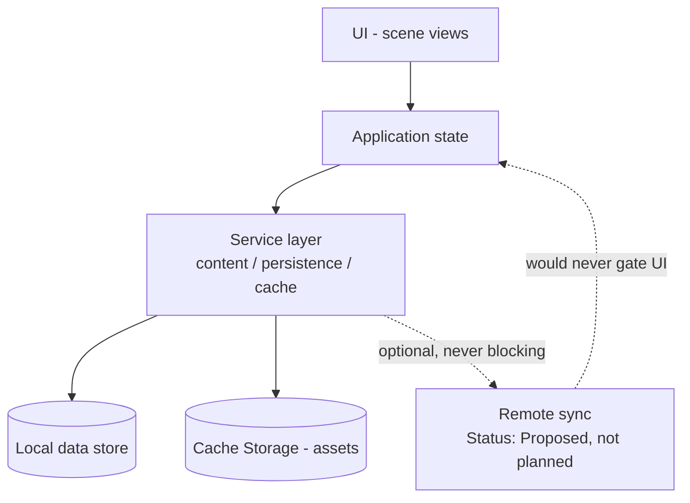
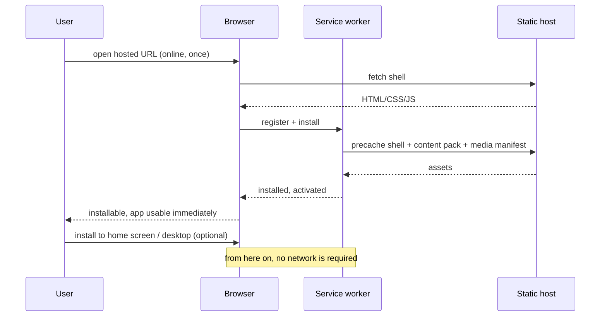
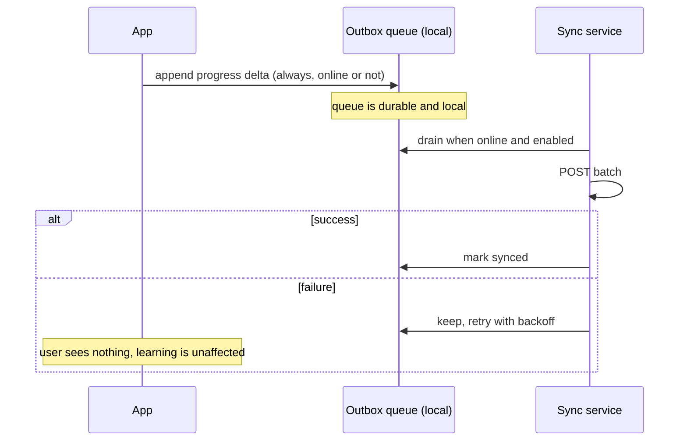

# Local-First Architecture

`Status: Proposed` — **no synchronisation is implemented, and none is currently planned.** This note documents the architecture and its open questions; it does not describe existing behaviour.

> Source: Project Brief (local-first, offline-capable, one codebase); Approved Proposal — Section `RENCANA IMPLEMENTASI` (offline `index.html` on lab computers, distributed via LMS or chat group)

## What "local-first" means here

The device is the primary — and currently the only — home of learner data. The network is used to *obtain* the application, never to *operate* it. A lab computer with the network cable unplugged is not a degraded mode; it is the design target.

Concretely:
- No request blocks a learning action.
- No feature is disabled when offline.
- No data is lost when the machine has never been online.
- Progress belongs to the browser profile on that machine (REQ-NF-011, [[ADR-008-No-Accounts-Device-Local-Progress]]).

## Layering

```text
UI (scene views)
  ↓
Application State (scene machine, stage models, progress engine)
  ↓
Local Data (IndexedDB / localStorage: progress, preferences)
  ↓
Service Layer (content service, persistence service, cache service)
  ↓
Optional Remote Synchronisation  ← not implemented, not planned
```



## What must work with no internet

Everything (REQ-PWA-002): home, guide, case study, all three stages with all validation, all 21 assessment items, feedback animations and audio, scoring, results dashboard, badge, certificate, and reset. There is no offline-only subset because there is no online-only feature.

## What lives locally

| Data | Store | Lifetime |
| --- | --- | --- |
| Progress record (score, meter, stage state, answers) | IndexedDB (proposed) | Until `[DESAIN ULANG]` or explicit clear |
| Preferences (mute, volume, reduced motion) | localStorage (proposed) | Survives reset |
| Content pack | Cache Storage (hosted) / filesystem (`file://`) | Until a content update |
| Media assets | Cache Storage / filesystem | Until an update |
| App shell | Cache Storage / filesystem | Until an update |

Store choice: [[ADR-004-Local-Persistence]]. Record shape: [[Data-Architecture]].

## First installation



For the `file://` lab bundle there is no install step at all: the folder is copied, `index.html` is opened, and everything is already local. That path has **no service worker** — see [[Offline-Strategy]].

## Going offline

Nothing happens. No banner, no state change, no re-fetch attempt ([[UI-States]] §Connectivity). Any in-flight optional request is abandoned silently.

## Progress persistence

Written after every scoring event — placement validated, DRC run, fit tested, item answered — not at stage boundaries. Rationale in [[Feature-Scoring-and-Progress]]. On load, the record is read, schema-checked and either resumed or reported as unreadable with a clean-reset action.

## Synchronisation

`Status: Proposed — not implemented, not planned` (REQ-PWA-008, priority `Could`)

Nothing in either approved document asks for cloud progress, and the group-work model ([[Assessment-Strategy]]) makes per-device records only weakly attributable to individuals. If sync is ever added, it must satisfy:

1. **Never blocking.** The UI never waits on it, never shows a spinner for it, never fails a learning action because of it.
2. **Additive.** Local remains authoritative; the remote copy is a backup.
3. **Explicit.** No silent upload — REQ-NF-011 means learner data leaving the device is a decision someone makes, not a default.

Sketch, if built:



**Conflict handling.** Single-device, single-writer today, so no conflict exists. If sync arrives, the proposed rule is last-write-wins per *run*, never per field — merging two half-runs of a lab exercise produces a score nobody earned. Runs are immutable once completed; a new attempt is a new run.

**If sync fails**, permanently or repeatedly: nothing user-visible beyond an optional passive indicator. The queue is bounded (proposed: most recent 20 runs) and drops oldest first. A failed sync must never delete a local record.

## Versioning

| Thing | Versioned by | On mismatch |
| --- | --- | --- |
| Progress record | `schemaVersion` | Migrate if possible; otherwise archive the old record and start fresh with a clear message |
| Content pack | semver `pack.version` | Minor/patch: keep the run. Major: finish or discard the in-progress run — rules may have changed under it |
| App shell | build hash | Update on next launch, never mid-stage ([[PWA-Architecture]]) |

## Cache invalidation

Owned by the service worker in the hosted topology: shell caches are keyed by build hash, asset caches by content-pack version; stale caches are deleted on activation. In the `file://` topology invalidation is a human copying a new folder — which is why the build must show its version in the UI ([[Deployment-Architecture]]).

## Storage limits

The whole product is < 25 MB (REQ-NF-001) plus a progress record measured in kilobytes, comfortably inside normal browser quotas. Risks: a shared lab machine with many browser profiles, aggressive storage eviction under disk pressure, and private-browsing sessions with near-zero quota. Mitigation: request persistent storage where available, detect quota errors, and degrade to session-only progress with an explicit warning rather than a silent failure ([[UI-States]]).

## Recovery

| Failure | Recovery |
| --- | --- |
| Corrupt progress record | Detect on load, archive it, offer a clean run |
| Cache evicted while offline (hosted) | Shell missing → the app cannot start; requires one online visit. Documented risk of the hosted topology, and the reason the `file://` bundle exists |
| Missing media asset | Mechanics continue without it |
| Quota exceeded | Session-only progress, explicit warning |
| Content pack invalid | Startup error naming the file ([[UI-States]]) |

## Related

- [[Offline-Strategy]] · [[PWA-Architecture]] · [[Data-Architecture]] · [[ADR-004-Local-Persistence]] · [[ADR-008-No-Accounts-Device-Local-Progress]]
