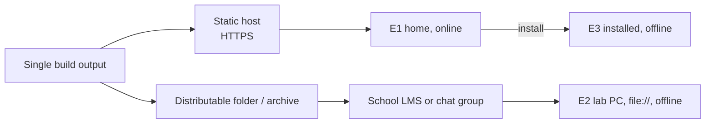

# Offline Strategy

Operational view: which environment runs which build, and what the learner experiences in each. Mechanism lives in [[PWA-Architecture]]; data ownership in [[Local-First-Architecture]].

## The three real environments

| # | Environment | When | Build | Service worker | Progress |
| --- | --- | --- | --- | --- | --- |
| E1 | Student device at home, online | Day −1, guide + case study (REQ-EDU-022) | Hosted PWA | Yes | Local to that device |
| E2 | School lab desktop, no internet | Core 45-minute session (REQ-NF-003) | `file://` bundle copied to disk | **No** | Local to that machine/profile |
| E3 | Installed PWA, offline | Any device installed while online, used later offline | Hosted PWA, installed | Yes | Local to that device |

E1 and E3 are the same build served from a host; E2 is the same build opened from disk (REQ-NF-010, [[ADR-005-Dual-Distribution]]).

Consequence worth stating plainly: **progress does not follow the learner between E1 and E2.** The home guide session and the lab session are separate records. Nothing in the proposal requires otherwise, and the group-work model means the lab record belongs to a group anyway.

## Offline capability by environment

| Capability | E1 | E2 | E3 |
| --- | --- | --- | --- |
| Guide, case study | ✔ | ✔ | ✔ |
| Stages 1–3 with full validation | ✔ | ✔ | ✔ |
| All 21 assessment items | ✔ | ✔ | ✔ |
| Media, audio, animations | ✔ | ✔ | ✔ |
| Scoring, results, badge | ✔ | ✔ | ✔ |
| Certificate | ✔ | ✔ (format-dependent — [[Feature-Results-Dashboard]]) | ✔ |
| Install to device | ✔ | ✖ (not applicable) | already installed |
| Automatic updates | ✔ | ✖ — a human copies a new folder | ✔ |

No learning capability differs across environments. That is the requirement (REQ-PWA-002), and it is why the offline story cannot depend on the service worker.

## `file://` engineering constraints — E2

These decide real build settings, so they are listed concretely:

1. **No service worker.** Do not register one when `location.protocol === 'file:'`; do not let any code path assume caching.
2. **No cross-origin module loading.** ES modules over `file://` are blocked by CORS in Chromium. The build must emit a classic-script bundle (or an inlined single file) for the E2 artefact — the same source, a different output target.
3. **All paths relative.** No leading `/` anywhere: HTML, CSS `url()`, JSON media manifest, dynamic imports (REQ-TECH-003).
4. **`fetch()` on `file://` is unreliable.** Content packs must be loadable without `fetch` in E2 — inline the pack, or load it via a script tag that assigns a global.
5. **Storage on `file://` is quirky.** Origin is opaque in some browsers; `localStorage` may be shared across all local files, and IndexedDB behaviour varies. Detect capability at runtime and degrade to session-only progress with an explicit warning ([[UI-States]]).
6. **No HTTPS-only APIs.** Nothing in the feature set needs them, which must stay true.

Every one of these is verified in [[Offline-Testing]].

## Distribution to the lab

> Source: Approved Proposal — Section `RENCANA IMPLEMENTASI` ("guru membagikan tautan akses berkas luring aplikasi… melalui platform LMS sekolah atau grup komunikasi")

The teacher shares an archive; students or the lab technician extract it and open `index.html`. Implications: the archive must be small enough to pass through an LMS or chat upload (25 MB helps), it must carry a visible version, and it must run from an arbitrary folder depth.

## Content updates offline

There is no over-the-air content update in E2. A corrected question or a changed value means redistributing the folder. Therefore:
- The build version and content-pack version are visible in the UI ([[Deployment-Architecture]]).
- Content changes are batched, not trickled.
- A changed pack version invalidates in-progress runs on major bumps only ([[Local-First-Architecture]] §Versioning).

## Related

- [[Local-First-Architecture]] · [[PWA-Architecture]] · [[Deployment-Architecture]] · [[Offline-Testing]] · [[ADR-005-Dual-Distribution]]
