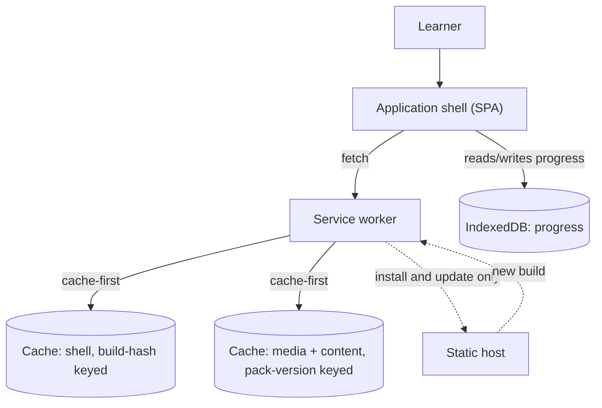
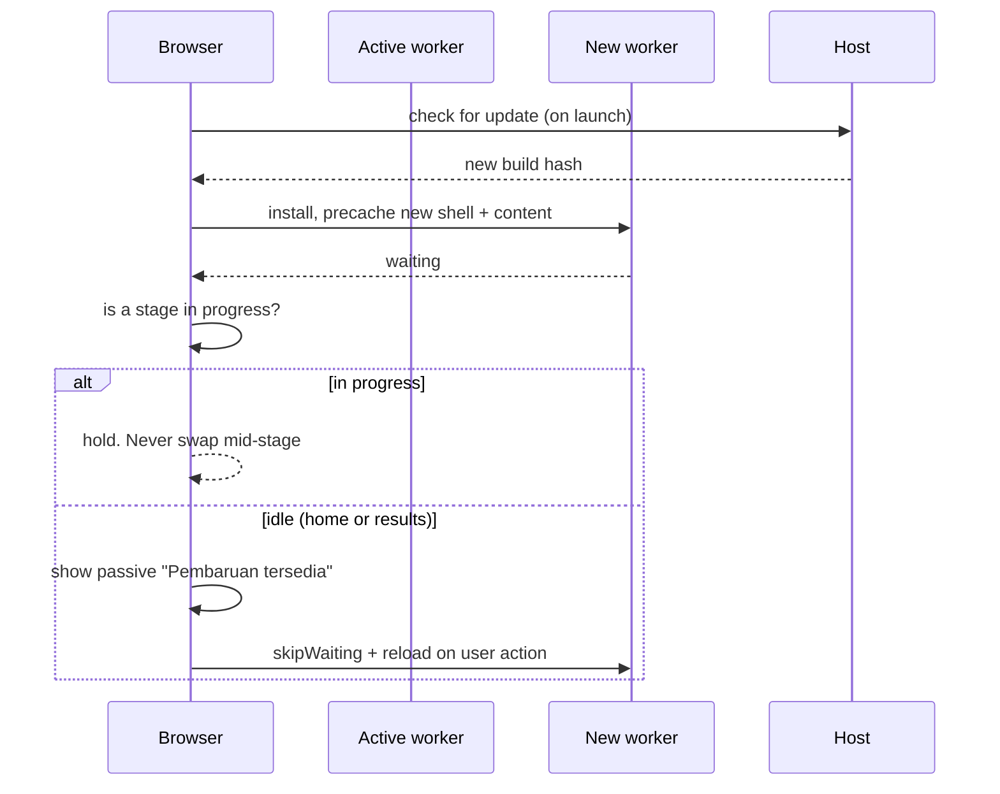

# PWA Architecture

`Status: Proposed` — nothing implemented. Requirements: REQ-PWA-001…010.

> Source: Project Brief (installable PWA, offline after install, deployable online)

## Topology

Note what is missing compared with a typical PWA diagram: there is **no runtime API traffic**. The service worker mediates asset delivery only; progress never passes through it.

## Web App Manifest — REQ-PWA-001

| Field | Value | Rationale |
| --- | --- | --- |
| `name` | E-DrawLab: Desain CAD Elektronika | Approved title |
| `short_name` | E-DrawLab | |
| `start_url` | `./` (relative) | Must work under a sub-path deployment (REQ-TECH-003) |
| `scope` | `./` | |
| `display` | `fullscreen` (fallback `standalone`) | Maximises the 16×9 stage (REQ-NF-002) |
| `orientation` | `landscape` | REQ-UX-001, [[Landscape-Design]] |
| `background_color` / `theme_color` | dark studio palette | Matches Scene 01 |
| `icons` | 192, 512, maskable | Installability baseline |
| `lang` | `id` | Content is Indonesian |
| `categories` | education | |

`orientation: landscape` is a hint, not a lock, on most platforms — the in-app portrait guard remains necessary.

## Caching strategy — REQ-PWA-003, 004

| Bucket | Strategy | Reason |
| --- | --- | --- |
| App shell (HTML, JS, CSS, fonts, icons) | **Precache on install**, cache-first | Must exist before the first offline use |
| Content pack (JSON) | **Precache on install**, cache-first | A stage cannot start without it |
| Media (art, audio, 3D assets) | **Precache on install**, cache-first | REQ-PWA-004 forbids lazy fetching at stage entry — a class of 30 hitting Stage 3 offline must not discover a missing asset |
| Anything else | No strategy — there is nothing else | No API, no analytics, no external fonts |

Precaching everything is affordable precisely because of the 25 MB budget (REQ-NF-001, REQ-PWA-009). The budget and the caching strategy justify each other.

Runtime `stale-while-revalidate` is deliberately **not** used: content that changes under a learner mid-run would invalidate their scoring rules ([[Local-First-Architecture]] §Versioning).

## App shell

The shell is scene-independent: layout frame, HUD, state machine, UI primitives. It renders before content resolves, so a slow disk read shows structure, not blank ([[UI-States]]).

## Offline fallback

There is no offline *fallback page*, because there is no online-only route to fall back from. A navigation request offline resolves from the shell cache exactly as it does online. The only genuine offline failure mode is "shell was never cached" — first visit offline — which is unreachable in practice: the hosted path requires one online visit by definition, and the lab path uses the `file://` bundle.

## Update strategy — REQ-PWA-005

Rules:
1. **Never auto-reload during a stage.** A 45-minute lesson cannot survive a reload at minute 30.
2. Update prompts are passive and dismissible ([[UI-States]]).
3. Old caches are deleted on activation, keyed by build hash and pack version.
4. The build version is visible in the UI so a teacher can confirm which copy a lab machine runs ([[Deployment-Architecture]]).

## Online/offline detection — REQ-PWA-006

Detected via `navigator.onLine` plus service-worker state, and used for exactly two things: deciding whether to check for updates, and — if sync is ever built — draining the outbox. It is **not** used to change the learning UI. Offline is normal; announcing it would be noise (P-5 in [[UX-Principles]]).

## Installability checklist

- [ ] Served over HTTPS
- [ ] Manifest with the fields above
- [ ] Registered service worker with a fetch handler
- [ ] Maskable icons at 192 and 512
- [ ] Install affordance in the UI, since browser prompts are inconsistent
- [ ] Verified installed launch works fully offline

Test plan: [[PWA-Testing]].

## Storage considerations — REQ-PWA-009

Cache Storage holds ~25 MB of shell, content and media; IndexedDB holds kilobytes of progress. Request persistent storage on first run to reduce eviction risk; handle quota errors as in [[Local-First-Architecture]] §Storage limits.

## The `file://` reality — REQ-PWA-010

Service workers **do not register on `file://`**. The lab bundle therefore has no service worker, no manifest install, and no caching layer — it does not need one, because the files are already on disk. This is why local-first is built at the application layer rather than delegated to the service worker: the same code must work with the worker absent. See [[ADR-005-Dual-Distribution]] and [[Offline-Strategy]].

## Related

- [[Local-First-Architecture]] · [[Offline-Strategy]] · [[Deployment-Architecture]] · [[Asset-Caching-Strategy]] · [[PWA-Testing]]
