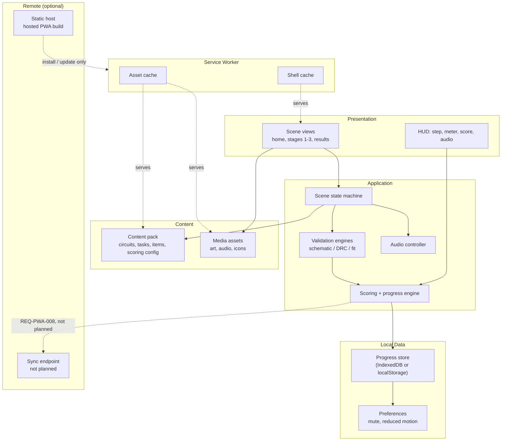
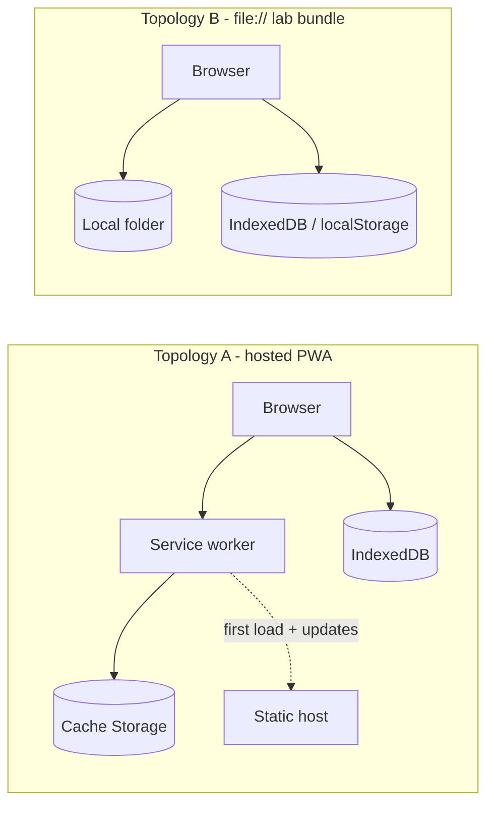

# System Architecture

`Status: Proposed` — no application code exists yet. Everything here is an engineering proposal constrained by the approved requirements.

> Source: Project Brief (web, local-first, PWA, offline, one codebase); Approved Proposal — Section `RENCANA IMPLEMENTASI` (offline `index.html`, no server)

## Layers

## Layer contracts

| Layer | Owns | Must not |
| --- | --- | --- |
| Presentation | Rendering, input capture, animation | Contain a validation rule or a content value |
| Application | State machine, validation, scoring, audio policy | Touch the DOM in validation paths (REQ-TECH-005) |
| Local data | Persistence, schema versioning, migration | Assume a network |
| Content | Circuits, tasks, questions, scoring config, media manifest | Depend on application internals (REQ-NF-012) |
| Service worker | Caching, update lifecycle | Be required for correctness — the `file://` build has none |
| Remote | Hosting and distribution | Be required at runtime (REQ-TECH-001) |

The last row is the load-bearing one: **the network is never in a critical path.** Every learning function completes with the machine in airplane mode.

## Runtime deployment topologies

Same build, two distributions — [[ADR-005-Dual-Distribution]] and [[Deployment-Architecture]]. Topology B has **no service worker** (browsers do not register one on `file://`), which is precisely why local-first cannot be delegated to the service worker: see [[Local-First-Architecture]].

## Key constraints shaping this architecture

| Constraint | Consequence |
| --- | --- |
| REQ-TECH-001 — no server runtime | All logic client-side; no API layer exists to design |
| REQ-NF-001 — < 25 MB | The media manifest and any 3D library are budget items, not free choices |
| REQ-NF-003 — runs from `index.html` | No absolute URLs, no origin-relative paths, no ES module CORS assumptions on `file://` |
| REQ-NF-012 — content independent of code | Content pack is a versioned artefact with its own schema |
| REQ-PWA-002 — full offline | Everything precached; nothing lazily fetched at stage entry |
| REQ-NF-011 — no accounts | No auth, no user identity, no server state to reconcile |

## What is deliberately absent

No backend, no database server, no authentication, no analytics, no CDN dependency at runtime, no third-party embeds. Each of these would break either REQ-TECH-001 or REQ-NF-011, and none is requested by either approved document.

## Related

- [[Application-Architecture]] · [[Content-Architecture]] · [[Data-Architecture]]
- [[Local-First-Architecture]] · [[PWA-Architecture]] · [[Deployment-Architecture]]
