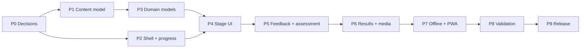

# Roadmap

Derived from the approved requirements, the current repository state (documentation only — no application code), the dependency graph in [[Functional-Requirements]], and the local-first/PWA constraints.

Phases are ordered by dependency, not by calendar. No dates are given: neither approved document states a schedule, and inventing one would be fiction.

## Phase 0 — Decisions and foundation

**Objective.** Remove the blockers that make every later phase ambiguous.

**Deliverables**
- Resolve [[ADR-002-Frontend-Stack]] and [[ADR-006-3D-Rendering-Approach]] (the latter after a lab hardware inventory).
- Answer the blocking product questions in [[Open-Questions]]: Stage 2 slider range and tolerance, Stage 3 learner-controlled variables, score mapping, step count.
- Repository skeleton, build for both artefacts ([[ADR-005-Dual-Distribution]]), CI with the size gate.
- `file://` smoke test in CI from day one.

**Dependencies.** None.

**Acceptance.** An empty shell builds as both artefacts, passes the size gate, and opens by double-clicking `index.html`.

**Requirements.** REQ-TECH-006, REQ-TECH-003, REQ-NF-001, REQ-NF-010.

## Phase 1 — Content model

**Objective.** Make content authorable before any stage is built, so content and code progress in parallel.

**Deliverables**
- JSON Schemas per [[Content-Architecture]]; validation in CI and at startup.
- Content pack populated with everything already specified: three circuits, the copper-weight table and exercise set, the casing model tasks, all 18 items ([[Question-Bank]]).
- Explicit `null`s for undecided values, rather than invented ones.
- Authoring notes for the teacher-owned gaps in [[Content-Inventory]].

**Dependencies.** Phase 0 stack decision.

**Acceptance.** A malformed pack fails CI; a valid pack loads and validates at startup; a teacher can change a value without touching code.

**Requirements.** REQ-NF-012, REQ-TECH-002, REQ-EDU-009…013.

## Phase 2 — Shell, navigation, progress

**Objective.** The frame everything else plugs into.

**Deliverables**
- Scene state machine, HUD (step indicator, meter, score), overlay layer.
- Progress engine and persistence with the fallback path ([[ADR-004-Local-Persistence]]).
- Home, guide overlay, case study ([[Feature-Guide-and-Case-Study]]).
- Layout system: scaled 16×9 stage plus responsive chrome, portrait guard ([[ADR-009-Landscape-First-Layout]]).

**Dependencies.** Phases 0–1.

**Acceptance.** All five scene routes reachable with placeholder stages, zero document reloads; progress survives a reload; the portrait guard behaves per [[Landscape-Design]].

**Requirements.** REQ-F-001…004, 018, 022, 028, REQ-PWA-007, REQ-UX-001, 002.

## Phase 3 — Stage domain models

**Objective.** The curriculum, as tested code, before any of it is drawn.

**Deliverables**
- Schematic slot/topology validator; PCB DRC (width, 45°, connectivity, etch floor); casing dimension and fit model.
- Reason-code vocabulary shared with [[Feedback-Model]].
- Unit tests covering every worked example in [[Question-Bank]] and every failure mode.

**Dependencies.** Phase 1.

**Acceptance.** Every revision worked answer is reproduced by the models in tests; models run with no DOM.

**Requirements.** REQ-TECH-005, REQ-EDU-009…012, REQ-F-007, 011, 014.

## Phase 4 — Stage interfaces

**Objective.** Make the models playable.

**Deliverables**
- Stage 1 workbench: drag & drop, etiket, library ([[Feature-Schematic-Workbench]]).
- Stage 2 router: slider, copper-weight control, 45° routing, DRC button ([[Feature-PCB-Router]]).
- Stage 3 modeller: three sliders, 3D box, orbit, fit test ([[Feature-Casing-Modeller]]).
- Mouse, touch and keyboard paths for all three (REQ-UX-003, 004).

**Dependencies.** Phases 2–3; the Phase 0 rendering decision.

**Acceptance.** All three stages completable end to end with placeholder art, on desktop and on a touch device.

**Requirements.** REQ-F-005…014, 029.

## Phase 5 — Feedback, audio, assessment

**Objective.** The product's identity mechanic and its assessment layer.

**Deliverables**
- Consequence choreography per failure mode, with educational text and accessible announcements ([[Feedback-Model]]).
- Meter and scoring rules driven by content configuration.
- Quiz engine and stage-embedded items ([[Feature-Quiz-Engine]]).
- Audio system with layers, ducking, autoplay unlock and mute ([[Feature-Audio-System]]).

**Dependencies.** Phases 3–4; the score-mapping answer from Phase 0.

**Acceptance.** Every failure mode produces its visual + textual + audio signal; the whole product remains fully comprehensible muted.

**Requirements.** REQ-F-015…017, 020, 023, REQ-EDU-013…016, REQ-UX-006, 007.

## Phase 6 — Results, media, polish

**Objective.** Finish the experience and land the assets.

**Deliverables**
- Results dashboard, badge, certificate, `[DESAIN ULANG]`, attribution ([[Feature-Results-Dashboard]]).
- Final media production against [[Media-Asset-Register]] and the buckets in [[ADR-007-Asset-Budget]].
- Authored content gaps filled: reflective quiz stems, instrument descriptions, case-study narrative, failure texts.

**Dependencies.** Phase 5; teacher-authored content.

**Acceptance.** A complete run from home to certificate with final assets, inside the size gate.

**Requirements.** REQ-F-019, 021, 022, 026, 027, REQ-EDU-017, REQ-NF-001, 007.

## Phase 7 — Offline and PWA hardening

**Objective.** Prove both distributions in their real environments.

**Deliverables**
- Manifest, service worker, precache manifest, update flow ([[PWA-Architecture]]).
- `file://` artefact verified against every constraint in [[Offline-Strategy]].
- Quota, eviction and corrupt-state recovery paths ([[UI-States]]).

**Dependencies.** Phase 6 (the asset list must be final to precache it).

**Acceptance.** [[PWA-Testing]] and [[Offline-Testing]] pass, including a full run on a machine that has never been online.

**Requirements.** REQ-PWA-001…010, REQ-NF-003.

## Phase 8 — Validation with users

**Objective.** Verify the thing teaches, not merely runs.

**Deliverables**
- Usability testing with the real group model, 3–4 students per screen ([[Usability-Testing]]).
- Educational validation of items and outcomes ([[Educational-Testing]]).
- Timing validation against the 45-minute core phase ([[Curriculum]] §Time budget).
- Accessibility review against the [[Accessibility]] baseline.

**Dependencies.** Phase 7.

**Acceptance.** A real class completes the core phase within its time budget; failing items or tasks are identified and corrected in content.

**Requirements.** REQ-EDU-019, 020, REQ-NF-013, REQ-UX-003…007.

## Phase 9 — Release

**Deliverables.** Hosted deployment, distribution archive, release checklist in [[Deployment-Architecture]], teacher handover for content editing.

**Acceptance.** A teacher can distribute the archive and run the lesson unaided.

## Critical path

The real risk is Phase 0: two undecided ADRs and four unanswered product questions block work that otherwise has no ambiguity. See [[Open-Questions]].

## Related

- [[Milestones]] · [[Tasks]] · [[Requirements-Matrix]] · [[Technical-Debt]]
